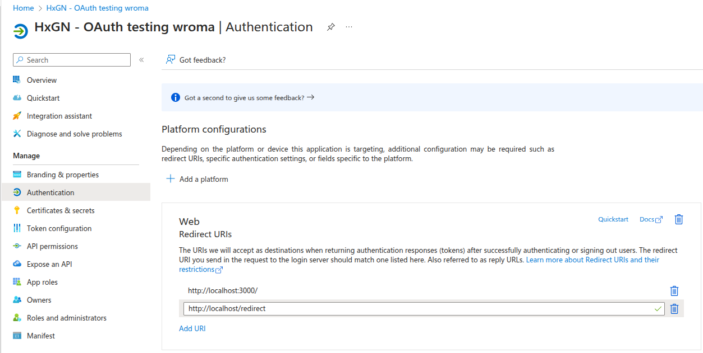
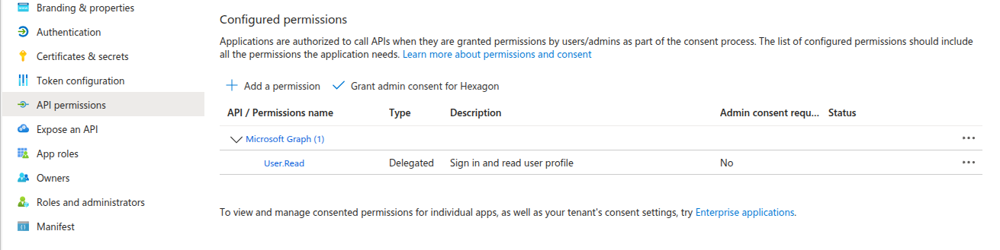
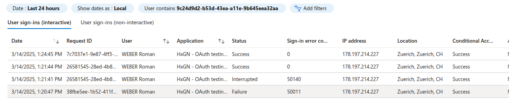

# App registration settings

This is only a proof of concept to get a feeling how such a login flow. The app registration was created in a different tentant(Hexagon). There are little settings necessary.

## Redirect URL

Not entirely sure if these URLs are correct.

## API Permissions

These permissions need to be granted by the user during the first login flow.

## Sign-in logs - but does it work?

Sign-in logs are shown as successful.

But the values returned like email address should be visible on the SPA. But they don't show up. Some troubleshooting is needed!
