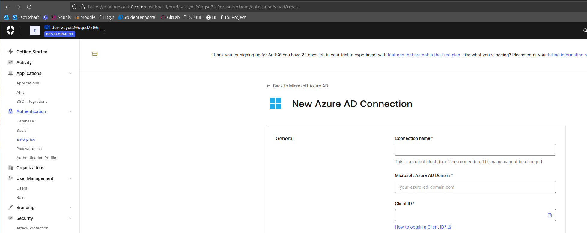

# Entra ID SSO notes

Notes and useful links on how to connect an application to Entra ID SSO by Roman Weber.

## Single sign-on options

When checking the diagram in the [SSO documentation](https://learn.microsoft.com/en-us/entra/identity/enterprise-apps/plan-sso-deployment#single-sign-on-options), it says to choose **OpenID Connect/OAuth 2.0** for new applications.

## OAuth authentication flow

The Identity provider (IDP) will be Microsoft Entra ID. An app registration is needed for to connect an app to a tenant. It is sufficient to create an app registration and make us owner, which allows us to make all the other configurations ourselves. [This documentation gives a good overview of what roles/parties are involved in OAuth](https://learn.microsoft.com/en-us/entra/identity-platform/v2-protocols).

## Quick-start: Single-page app

[This quick-start guide](https://learn.microsoft.com/en-us/entra/identity-platform/quickstart-single-page-app-sign-in?pivots=workforce&tabs=javascript-workforce%2Cjavascript-external) gives a sample application that enable SSO via an app registration. Good for a proof of concept.

## Next steps 14.03.2025

- ✅ Create ticket for OST IT that request an Entra ID app registration.
- ✅ Test sample application with another tenant.

App registration was created and can be found here: [Lost University SSO](https://portal.azure.com/#view/Microsoft_AAD_RegisteredApps/ApplicationMenuBlade/~/Overview/appId/bf9aa3af-f92b-429a-b44b-94e2ddbc4e0a/isMSAApp~/false).

## Continue work on 23.03.2025

Instead of using the sample application, Matteo suggested to used Auth0 or ... for the authentication part.

### Auth0

Auth0 tenant was created to see is this would be a viable solution. First impression was good, there is a [quick-start guide for vue.js](https://auth0.com/docs/quickstart/spa/vuejs/interactive). It also supports Entra ID (Azure AD is the old name) SSO.

**Problem is that the Entra ID connection is a paid feature**. When signing up, you have 22 days with all settings, after that it will require us to switch to an enterprise plan if Azure AD SSO is used.

- [Pricing](https://auth0.com/pricing#full-features)
- [Auth0 community post 1](https://community.auth0.com/t/is-enterprise-connections-with-azure-active-directory-included-with-developer-account/45099)
- [Auth0 community post 2](https://community.auth0.com/t/enterprise-connections-in-free-tier/49515)
